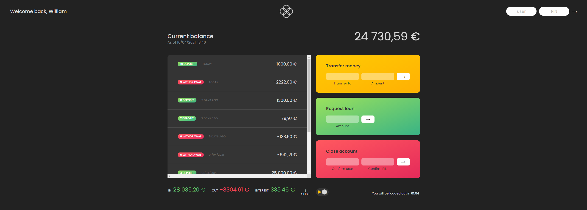
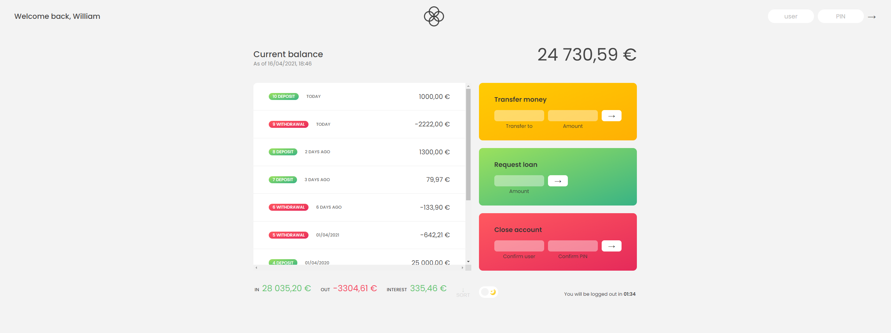

# Bankist ! :moneybag:

Bankist is a simulated bank web app made in vanilla Javascript.

🌙  | 🌞
------------- | -------------
  | 

- - - -

## Features

- Displays the movements, dates, balance, interests, in values, out values of a bank account.

- Transfer money between accounts. :left_right_arrow:

- Request a loan to the bank (with simulated delay). :money_with_wings:

- Close an account. :x:

- Logout timer after a certain amount of time. :timer_clock:

- Dark and light mode ! :crescent_moon:

- - - -

## Usage :computer:

There is two account object at your disposition :

Account 1  | Account 2
------------- | -------------
**User : wp** | **PIN: 1111**
**User : js** |**PIN: 2222**

Live version : 

## Contributing :hammer_and_wrench:

Do a pull request on the directory where I will review the changes before merge.

* Pull requests are welcome. For major changes, please open an 'issue' first to discuss what you want to change.

For more information on how to perform a pull request see the
link [here](https://opensource.com/article/19/7/create-pull-request-github).

## License

[MIT](https://choosealicense.com/licenses/mit/)
